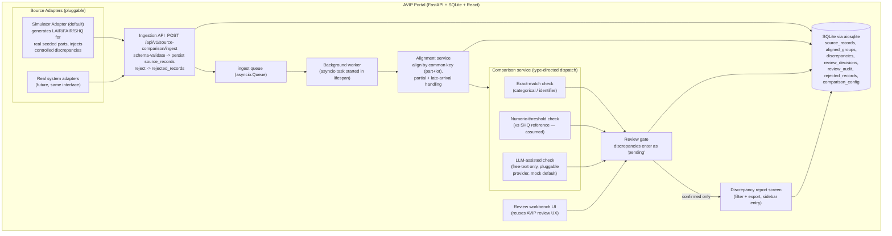

# Design — AVIP Source Comparison (LAIR / FAIR / SHQ)

## Overview

This feature adds a production-shaped **source-comparison capability** as a
native area of the existing **AVIP** portal. It ingests quality inspection
records from three sources — **LAIR**, **FAIR**, and **SHQ** — continuously
through a **pluggable source-adapter interface** (fed by a **simulator** by
default), persists every record, aligns records by a **common key**
(`part_number` + `lot_number`) as they stream in, compares a **comprehensive,
configurable field set** using the right check per field type
(exact-match / numeric-threshold / LLM-assisted), routes every flagged
discrepancy through a **mandatory human review gate**, and renders a
filterable, exportable **discrepancy report** as an AVIP screen.

It is the production-grade successor to the completed pilot at
`kiro-spec/lair-fair-shq-comparison/`. It inherits the pilot's proven pipeline
shape (align → compare → review-gate → report) and its eight correctness
properties, and adapts them to a **streaming** model. It is built entirely with
AVIP's existing stack — FastAPI under `/api/v1`, SQLite via `aiosqlite`,
React 18 + TypeScript (strict) + Tailwind v3 + React Query v5 + Recharts, the
shared `AppLayout`, and the shared `api` client — reusing the existing
review-workbench and dashboard UX so the new screens feel native.

### Assumption-driven open items (client confirmation pending)

The client confirmation is not yet available, so the two previously-open items
are resolved as **explicit, clearly-labelled assumptions** — never silent
defaults. The pilot's assumptions/open-items registry mechanism is retained;
items resolved-by-assumption are relabeled from `[CONFIRM]` to
**"assumed — pending client confirmation"** and are still surfaced in the report
header banner and in structured logs.

- **SHQ benchmark methodology (assumed).** SHQ is treated as the
  reference/source-of-truth for numeric fields. Numeric deviation is measured
  against SHQ's value and flagged when it exceeds the per-field configured
  threshold. Surfaced as an assumption in the report banner and logs.
- **Latency / load target (assumed).** Near-real-time target of ~5s per record
  end-to-end under a simulated feed of a few records/second. Surfaced as an
  assumption.

Any assumption item still set to its placeholder emits a logged warning naming
the item and is shown in the report header (Req 8.5).

## Architecture

All components live inside AVIP. Source adapters (default: the simulator) push
records through the internal Ingestion API, which persists and enqueues them; a
background worker aligns records by common key as they arrive, runs the
type-directed comparison checks, and writes discrepancies into the review gate;
confirmed discrepancies flow into the report screen.



### Request/processing flow

1. A source adapter (simulator by default) calls `POST /api/v1/source-comparison/ingest`.
2. The Ingestion service validates the payload against the ingestion schema.
   Valid → persisted to `source_records` and enqueued on an in-process
   `asyncio.Queue`. Invalid → persisted to `rejected_records` with the source,
   record id, and reason; a 4xx error naming source + record id is returned
   (Req 1.6, 1.7).
3. The background worker (an `asyncio` task started in the FastAPI `lifespan`,
   mirroring the existing lifespan pattern) drains the queue, aligns each
   record into an `aligned_groups` row by common key, re-evaluating existing
   partial groups on late arrivals (Req 2.1–2.5).
4. For each aligned group, the comparison service dispatches every in-scope
   field to the check matching its configured type and writes `discrepancies`
   (each with provenance), all entering the gate as `pending` (Req 4).
5. Reviewers confirm/dismiss in the workbench; decisions + audit are recorded
   (Req 6).
6. The report screen renders only confirmed discrepancies, filterable and
   exportable (Req 7).

## Components and Interfaces

New backend area under `backend/app/`:

```
routers/source_comparison.py     # FastAPI router, registered under /api/v1
services/source_adapters.py      # Source_Adapter interface + SimulatorAdapter
services/ingestion.py            # schema validation, persist, enqueue
services/alignment.py            # common-key alignment (streaming)
services/comparison.py           # dispatch + 3 checks
services/llm_provider.py         # LLM_Provider interface + MockLLMProvider + OpenAILLMProvider
services/review.py               # review gate + audit  (source-comparison review)
services/report.py               # report assembly + export
services/worker.py               # background worker (asyncio task)
services/sc_config.py            # comparison configuration + assumptions registry
models/source_comparison.py      # Pydantic domain + request/response models
```

New frontend area under `frontend/src/`:

```
components/source-comparison/
  SourceComparisonReview.tsx     # review gate list (reuses ReviewQueue patterns)
  SourceComparisonWorkbench.tsx  # single-discrepancy confirm/dismiss (reuses ReviewWorkbench patterns)
  DiscrepancyReport.tsx          # filterable, exportable report screen
  IngestionMonitor.tsx           # small live status panel (throughput, rejected, assumptions banner)
api/source-comparison.ts         # typed api.get/api.post wrappers
types (add to src/types/index.ts) # shared TS types
```

### Backend — Source Adapter interface (Req 1.1, 1.2)

```python
# services/source_adapters.py
from typing import Protocol, AsyncIterator

class SourceAdapter(Protocol):
    source: str  # "LAIR" | "FAIR" | "SHQ"

    async def stream(self) -> AsyncIterator["IngestRecord"]:
        """Yield IngestRecord instances continuously over time."""

class SimulatorAdapter:
    """Default adapter. Emits LAIR/FAIR/SHQ records for the REAL seeded parts
    (from database.py `parts`), across the comprehensive field set, injecting a
    controllable rate of discrepancies (categorical mismatch, numeric deviation
    beyond threshold, differing free-text notes) so the gate/report have
    meaningful content. Configurable: records/sec, discrepancy_rate, lots/part.
    Pushes each record via the Ingestion API path a real system would use."""
    def __init__(self, rate_per_sec: float, discrepancy_rate: float, seed: int): ...
    async def stream(self) -> AsyncIterator["IngestRecord"]: ...
```

The simulator draws `part_number`, `material`, `surface_finish`, `supplier`
from the seeded `parts` table, synthesizes `lot_number`/`serial_number`, and
generates numeric fields (`diameter`, `thickness`, `flatness`, `hardness`)
around a per-part baseline. It designates SHQ as the numeric reference
(assumed) and perturbs LAIR/FAIR values so a controlled fraction exceed
thresholds, guaranteeing reviewable discrepancies.

### Backend — Ingestion service + API (Req 1.3–1.7, 9.2, 9.4)

```python
# routers/source_comparison.py — registered as:
#   app.include_router(source_comparison.router, prefix="/api/v1", tags=["Source Comparison"])

POST   /source-comparison/ingest        # body: IngestRecord -> 202 {record_id, accepted}
                                         #   invalid -> 422 {source, record_id, reason}
GET    /source-comparison/groups         # aligned groups (filter: part, lot, state)
GET    /source-comparison/groups/{id}    # one aligned group + its records
GET    /source-comparison/rejected       # rejected_records list
GET    /source-comparison/status         # worker/throughput/assumptions snapshot
```

```python
# services/ingestion.py
async def ingest(record: IngestRecord) -> IngestResult:
    """Validate against the ingestion schema. On success persist to
    source_records and enqueue for the worker (Req 1.4, 1.5). On failure persist
    to rejected_records with source+record_id+reason and raise a 422 naming both
    (Req 1.6, 1.7). Never discards a record."""
```

### Backend — Alignment service (Req 2.1–2.5)

```python
# services/alignment.py
async def align_record(record: SourceRecord) -> AlignedGroup:
    """Find-or-create the aligned_groups row for record's common key and attach
    the record (Req 2.1). Update present/absent source flags and recompute
    alignment_state (partial | complete). Late arrivals re-evaluate an existing
    partial group (Req 2.2, 2.3, 2.4). Attaching the same record id twice is
    idempotent. If no valid common key can be derived, mark the record unmatched
    and retain it (Req 2.5)."""
```

The common-key definition is read from configuration (Req 8.3). Alignment
completing (or re-completing) a group triggers comparison for that group.

### Backend — Comparison service + checks (Req 3, 4)

```python
# services/comparison.py
def classify_field(field_name: str, config: ComparisonConfig) -> FieldType:
    """Return NUMERIC | CATEGORICAL | IDENTIFIER | FREE_TEXT from configured
    field type, not a hardcoded list (Req 3.6). Fields not in scope are skipped
    (Req 3.7)."""

def check_exact(group, field) -> Discrepancy | None:
    """Categorical/identifier. Flag iff values differ across present sources
    (Req 4.1, 4.5). Provenance = 'exact-match'."""

def check_numeric(group, field, threshold) -> Discrepancy | None:
    """Flag iff |value - SHQ_value| exceeds per-field threshold; SHQ is the
    reference (assumed — pending confirmation). Provenance = 'numeric-threshold'
    (Req 4.2, 4.5, 8.2)."""

def check_free_text(group, field, llm: LLMProvider) -> Discrepancy | None:
    """LLM-assisted, free-text only (Req 3.3, 4.3). Provenance = 'llm'. Result
    always enters the gate as pending, never auto-confirmed (Req 5.4). On
    provider error, route to manual review with provenance
    'llm-unavailable' — never treated as agreeing (Req 5.5)."""

async def compare_group(group: AlignedGroup, config, llm) -> list[Discrepancy]:
    """Dispatch each in-scope field by classify_field; collect discrepancies,
    each carrying non-empty provenance (Req 4.4). Persist as pending."""
```

### Backend — LLM Provider interface (Req 5.1–5.5)

```python
# services/llm_provider.py
class LLMProvider(Protocol):
    async def compare_text(self, a: str | None, b: str | None) -> LLMComparison:
        """Return {differ: bool, rationale: str}."""

class MockLLMProvider:   # default, no external dependency (Req 5.2)
    ...
class OpenAILLMProvider: # mirrors existing config.openai_* pattern
    ...

def get_llm_provider(config) -> LLMProvider:
    """Select provider from config (Req 5.3); default Mock. No code change to
    swap."""
```

Provider selection mirrors the existing `AVIP_VISION_LLM` / `OPENAI_API_KEY` /
`OPENAI_MODEL` env pattern via `app/config.py`.

### Backend — Review service + gate (Req 6, 9.3)

```python
# services/review.py  (routes on the same router)
GET   /source-comparison/review/queue           # pending discrepancies (reuses queue shape)
GET   /source-comparison/review/{discrepancy_id} # detail for the workbench
POST  /source-comparison/review/{discrepancy_id}/decide
      # body: {decision: "confirmed"|"dismissed", reviewer: str, note?: str}
```

`decide` records the decision, reviewer identity, optional note, and timestamp
against the discrepancy AND writes an immutable `review_audit` row (Req 6.3,
9.3). Until a discrepancy is `confirmed` it is excluded from the report;
`dismissed` is permanently excluded (Req 6.4, 6.5).

### Backend — Report service (Req 7)

```python
# services/report.py  (routes on the same router)
GET  /source-comparison/report
     # filters: part, lot, source, field, provenance -> confirmed discrepancies only
GET  /source-comparison/report/export?format=csv
     # downloadable file (CSV; JSON optional). Confirmed only.
GET  /source-comparison/report/header
     # assumptions/open-items banner data (Req 8.5)
```

Each report row includes part+lot, field name, the value from each present
source, and provenance (Req 7.2).

### Backend — Configuration + assumptions registry (Req 8)

```python
# services/sc_config.py — extends app/config.py Settings
class ComparisonConfig(BaseModel):
    common_key: list[str] = ["part_number", "lot_number"]     # Req 8.3
    fields: dict[str, FieldConfig]                            # in-scope set + types  Req 8.1, 3.6
    numeric_thresholds: dict[str, float]                      # per-field            Req 8.2
    llm_provider: str = "mock"                                # Req 8.4, 5.2
    assumptions: list[AssumptionItem]                         # relabeled [CONFIRM]  Req 8.5

class AssumptionItem(BaseModel):
    key: str                 # e.g. "shq_numeric_benchmark", "latency_target"
    label: str               # human text
    status: Literal["assumed", "unresolved"]  # "assumed — pending client confirmation"
    value: str | None
```

On startup, any assumption with `status="unresolved"` still at placeholder emits
a logged warning and is surfaced in `report/header` rather than silently
defaulted (Req 8.5).

### Backend — Background worker (Req 1.5, 9.1, 9.5)

```python
# services/worker.py
async def run_worker(queue: asyncio.Queue) -> None:
    """Drain the ingest queue; for each record: align_record -> if group state
    changed, compare_group. Per-record failures are caught, logged (structured),
    and the record's error retained; the worker keeps running (Req 9.5)."""
```

Started/stopped in `main.py` `lifespan` alongside `init_db()` and the simulator
adapter task, mirroring the existing startup/shutdown structure.

### Frontend — types, api module, hooks (React Query v5)

```typescript
// src/types/index.ts (additions)
export type SCFieldType = "numeric" | "categorical" | "identifier" | "free_text";
export type SCProvenance = "exact-match" | "numeric-threshold" | "llm" | "llm-unavailable";
export type SCReviewState = "pending" | "confirmed" | "dismissed";

export interface SCSourceValue { source: "LAIR" | "FAIR" | "SHQ"; value: string | number | null; }

export interface SCDiscrepancy {
  id: string;
  part_number: string;
  lot_number: string;
  field_name: string;
  field_type: SCFieldType;
  values: SCSourceValue[];
  provenance: SCProvenance;
  review_state: SCReviewState;
  reviewer: string | null;
  reviewer_note: string | null;
  decided_at: string | null;
}

export interface SCAssumption { key: string; label: string; status: "assumed" | "unresolved"; value: string | null; }
export interface SCStatus { ingested: number; rejected: number; groups_partial: number; groups_complete: number; assumptions: SCAssumption[]; }
```

```typescript
// src/api/source-comparison.ts
import { api } from "./client";
import type { SCDiscrepancy, SCStatus, SCAssumption } from "../types";

export const getReviewQueue = () =>
  api.get<{ data: SCDiscrepancy[]; total_count: number }>("/source-comparison/review/queue");
export const getDiscrepancy = (id: string) =>
  api.get<SCDiscrepancy>(`/source-comparison/review/${id}`);
export const decideDiscrepancy = (id: string, body: { decision: "confirmed" | "dismissed"; reviewer: string; note?: string }) =>
  api.post(`/source-comparison/review/${id}/decide`, body);
export const getReport = (params: Record<string, string>) =>
  api.get<{ data: SCDiscrepancy[] }>(`/source-comparison/report?${new URLSearchParams(params)}`);
export const getReportHeader = () =>
  api.get<{ assumptions: SCAssumption[] }>("/source-comparison/report/header");
export const getStatus = () => api.get<SCStatus>("/source-comparison/status");
export const exportReportUrl = (params: Record<string, string>) =>
  `/api/v1/source-comparison/report/export?${new URLSearchParams({ format: "csv", ...params })}`;
```

React Query hook shapes (v5 object form), consistent with AVIP usage:

```typescript
useQuery({ queryKey: ["sc", "review-queue"], queryFn: getReviewQueue, refetchInterval: 5000 });
useQuery({ queryKey: ["sc", "report", filters], queryFn: () => getReport(filters) });
useMutation({ mutationFn: (v) => decideDiscrepancy(v.id, v.body),
  onSuccess: () => queryClient.invalidateQueries({ queryKey: ["sc"] }) });
```

### Frontend — routing + sidebar wiring

Routes are added inside the shared `<AppLayout>` in `src/App.tsx`:

```tsx
<Route path="/source-comparison/review" element={<SourceComparisonReview />} />
<Route path="/source-comparison/review/:id" element={<SourceComparisonWorkbench />} />
<Route path="/source-comparison/report" element={<DiscrepancyReport />} />
```

A sidebar entry is added to `NAV_GROUPS` in `AppLayout.tsx` (Operations or a new
"Source Comparison" group), e.g. `{ label: "Source Comparison", to:
"/source-comparison/report", icon: GitCompare }`, plus a `getPageTitle` case.
The review list reuses the `ReviewQueue` layout; the workbench reuses
`ReviewWorkbench` patterns; the report reuses dashboard/table + Recharts styling.

## Data Models

New SQLite tables follow the `SCHEMA_SQL` conventions in `database.py`: TEXT
primary keys (uuid strings), TEXT timestamps in ISO format, JSON stored in TEXT
columns, indexes declared alongside, `foreign_keys=ON`. They are appended to
`SCHEMA_SQL` so `init_db()` creates them.

```sql
CREATE TABLE IF NOT EXISTS sc_source_records (
    id TEXT PRIMARY KEY,
    source TEXT NOT NULL,               -- LAIR | FAIR | SHQ
    external_record_id TEXT NOT NULL,   -- id from the source/adapter
    part_number TEXT NOT NULL,
    lot_number TEXT NOT NULL,
    serial_number TEXT,
    fields TEXT NOT NULL DEFAULT '{}',  -- JSON: field_name -> raw value
    group_id TEXT,                      -- FK sc_aligned_groups.id (null until aligned/unmatched)
    received_at TEXT NOT NULL,
    FOREIGN KEY (group_id) REFERENCES sc_aligned_groups(id)
);

CREATE TABLE IF NOT EXISTS sc_aligned_groups (
    id TEXT PRIMARY KEY,
    part_number TEXT NOT NULL,
    lot_number TEXT NOT NULL,
    present_sources TEXT NOT NULL DEFAULT '[]',  -- JSON list e.g. ["LAIR","SHQ"]
    alignment_state TEXT NOT NULL,               -- partial | complete | unmatched
    created_at TEXT NOT NULL,
    updated_at TEXT NOT NULL,
    UNIQUE (part_number, lot_number)
);

CREATE TABLE IF NOT EXISTS sc_discrepancies (
    id TEXT PRIMARY KEY,
    group_id TEXT NOT NULL,
    part_number TEXT NOT NULL,
    lot_number TEXT NOT NULL,
    field_name TEXT NOT NULL,
    field_type TEXT NOT NULL,           -- numeric | categorical | identifier | free_text
    values TEXT NOT NULL DEFAULT '{}',  -- JSON: source -> value
    provenance TEXT NOT NULL,           -- exact-match | numeric-threshold | llm | llm-unavailable
    review_state TEXT NOT NULL DEFAULT 'pending',
    created_at TEXT NOT NULL,
    FOREIGN KEY (group_id) REFERENCES sc_aligned_groups(id),
    UNIQUE (group_id, field_name)       -- one discrepancy per field per group (idempotent recompare)
);

CREATE TABLE IF NOT EXISTS sc_review_decisions (
    id TEXT PRIMARY KEY,
    discrepancy_id TEXT NOT NULL UNIQUE,
    decision TEXT NOT NULL,             -- confirmed | dismissed
    reviewer TEXT NOT NULL,
    note TEXT,
    decided_at TEXT NOT NULL,
    FOREIGN KEY (discrepancy_id) REFERENCES sc_discrepancies(id)
);

CREATE TABLE IF NOT EXISTS sc_review_audit (
    id TEXT PRIMARY KEY,
    discrepancy_id TEXT NOT NULL,
    decision TEXT NOT NULL,
    reviewer TEXT NOT NULL,
    note TEXT,
    decided_at TEXT NOT NULL,
    FOREIGN KEY (discrepancy_id) REFERENCES sc_discrepancies(id)
);

CREATE TABLE IF NOT EXISTS sc_rejected_records (
    id TEXT PRIMARY KEY,
    source TEXT,
    external_record_id TEXT,
    raw_payload TEXT NOT NULL,          -- JSON of the offending record
    reason TEXT NOT NULL,
    rejected_at TEXT NOT NULL
);

CREATE TABLE IF NOT EXISTS sc_comparison_config (
    id TEXT PRIMARY KEY DEFAULT 'default',
    common_key TEXT NOT NULL DEFAULT '["part_number","lot_number"]',
    fields TEXT NOT NULL DEFAULT '{}',          -- JSON: field -> {type, in_scope, threshold?}
    llm_provider TEXT NOT NULL DEFAULT 'mock',
    assumptions TEXT NOT NULL DEFAULT '[]',     -- JSON list of AssumptionItem
    updated_at TEXT NOT NULL
);

CREATE INDEX IF NOT EXISTS idx_sc_source_group ON sc_source_records(group_id);
CREATE INDEX IF NOT EXISTS idx_sc_source_key ON sc_source_records(part_number, lot_number);
CREATE INDEX IF NOT EXISTS idx_sc_disc_group ON sc_discrepancies(group_id);
CREATE INDEX IF NOT EXISTS idx_sc_disc_state ON sc_discrepancies(review_state);
CREATE INDEX IF NOT EXISTS idx_sc_disc_key ON sc_discrepancies(part_number, lot_number);
CREATE INDEX IF NOT EXISTS idx_sc_audit_disc ON sc_review_audit(discrepancy_id);
```

Pydantic models (`models/source_comparison.py`), mirroring `models/inspection.py`
style (`str, Enum` + `BaseModel`):

```python
class SourceType(str, Enum): LAIR = "LAIR"; FAIR = "FAIR"; SHQ = "SHQ"
class FieldType(str, Enum): NUMERIC="numeric"; CATEGORICAL="categorical"; IDENTIFIER="identifier"; FREE_TEXT="free_text"
class Provenance(str, Enum): EXACT="exact-match"; NUMERIC="numeric-threshold"; LLM="llm"; LLM_UNAVAILABLE="llm-unavailable"
class ReviewState(str, Enum): PENDING="pending"; CONFIRMED="confirmed"; DISMISSED="dismissed"

class IngestRecord(BaseModel):
    source: SourceType
    external_record_id: str
    part_number: str
    lot_number: str
    serial_number: str | None = None
    fields: dict[str, object] = {}

class Discrepancy(BaseModel):
    id: str; group_id: str; part_number: str; lot_number: str
    field_name: str; field_type: FieldType
    values: dict[str, object]; provenance: Provenance
    review_state: ReviewState = ReviewState.PENDING

class DecideRequest(BaseModel):
    decision: Literal["confirmed", "dismissed"]
    reviewer: str
    note: str | None = None
```

TypeScript models mirror these (see the frontend `src/types/index.ts` additions
above).

## Correctness Properties

*A property is a characteristic or behavior that should hold true across all
valid executions of a system — essentially, a formal statement about what the
system should do. Properties serve as the bridge between human-readable
specifications and machine-verifiable correctness guarantees.*

The eight pilot properties are carried forward and adapted to streaming, and
three streaming-specific properties are added. Redundancy was reviewed: the
pilot "no silent drop" invariant is now a persistence-and-classification
partition property; the two review-gate pilot properties are kept distinct
(one for report inclusion, one for decision round-trip) because they validate
different requirements.

### Property 1: Every ingested record is persisted and classified

*For any* sequence of ingested records, every accepted record SHALL be persisted
and SHALL end up in exactly one state — attached to an aligned group, marked
unmatched, or (if invalid) stored in rejected-records with a reason — and no
accepted record SHALL be absent from all three stores.

**Validates: Requirements 1.4, 1.7, 2.5, 9.2**

### Property 2: Discrepancy detection is correct at the threshold boundary

*For any* aligned group and in-scope field present in more than one source, the
field SHALL be flagged if and only if the values are discrepant: for
categorical/identifier fields iff values differ; for numeric fields iff the
deviation from the SHQ reference (assumed) exceeds the per-field configured
threshold. Values agreeing within the rule/threshold SHALL NOT be flagged.

**Validates: Requirements 4.1, 4.2, 4.5**

### Property 3: Every flag carries its provenance

*For any* discrepancy produced by the comparison service, the discrepancy SHALL
carry a non-empty provenance identifying the check that produced it.

**Validates: Requirements 4.4**

### Property 4: Comparison dispatch uses the LLM for free-text only

*For any* in-scope field, the LLM-assisted check SHALL be invoked if and only if
the field is classified free-text; numeric, categorical, and identifier fields
SHALL use the numeric-threshold and exact-match checks respectively and SHALL
NOT invoke the LLM.

**Validates: Requirements 3.3, 4.3**

### Property 5: Unconfirmed discrepancies never reach the report

*For any* set of discrepancies with arbitrary review states, the report SHALL
contain exactly those whose recorded decision is confirmed; no pending or
dismissed discrepancy SHALL appear.

**Validates: Requirements 6.1, 6.4, 6.5, 7.2**

### Property 6: Review decisions round-trip with audit

*For any* discrepancy and any confirm/dismiss decision recorded against it with
reviewer and note, reading the discrepancy back SHALL yield that decision,
reviewer, and note, and a corresponding audit entry with a timestamp SHALL
exist.

**Validates: Requirements 6.3, 9.3**

### Property 7: LLM free-text output always routes through review

*For any* discrepancy produced by the LLM free-text check — including the
provider-unavailable case — the discrepancy SHALL enter the gate as pending with
appropriate provenance and SHALL never be auto-confirmed or treated as agreeing;
it becomes final only through a recorded reviewer confirmation.

**Validates: Requirements 5.4, 5.5**

### Property 8: Report rows are complete

*For any* confirmed discrepancy rendered in the report, the row SHALL include
the part+lot identifier, the field name, the value from each present source, and
the provenance that produced the flag.

**Validates: Requirements 7.2**

### Property 9: Alignment is idempotent and order-independent (streaming)

*For any* set of records for a common key delivered in any order and with
arbitrary duplicate re-delivery, the resulting aligned group SHALL contain each
distinct source record exactly once and SHALL report the same present-sources
set and alignment state as if the records had arrived in any other order.

**Validates: Requirements 2.1, 2.2, 2.3, 2.4**

### Property 10: Late arrival completes without loss

*For any* partial group and any later-arriving record for its common key, after
attachment the group SHALL include the earlier records plus the new record and
SHALL re-evaluate to the correct alignment state, with no earlier record
dropped.

**Validates: Requirements 2.2, 2.3, 9.2**

### Property 11: Invalid records are rejected with identifying detail, never dropped

*For any* received record that does not conform to the ingestion schema, the
system SHALL store it in rejected-records with a reason naming the source and
record identifier and SHALL NOT enqueue it for alignment/comparison.

**Validates: Requirements 1.6, 1.7**

## Error Handling

- **Ingestion schema rejection (Req 1.6, 1.7).** Invalid payloads are written to
  `sc_rejected_records` with `source`, `external_record_id`, `raw_payload`, and
  `reason`; the endpoint returns `422` naming source + record id. Records are
  never silently discarded.
- **Assumption / open-item surfacing contract (Req 8.5).** Items resolved by
  assumption (SHQ numeric benchmark; latency/load target) are stored in the
  config `assumptions` registry with status `"assumed"` and label
  "assumed — pending client confirmation". Any remaining `"unresolved"` item at a
  placeholder value emits a logged warning naming it and is surfaced in
  `report/header` and the report banner — never silently defaulted.
- **LLM provider failure (Req 5.5, 9.5).** On provider error/timeout, the
  free-text field is emitted as a pending discrepancy with provenance
  `llm-unavailable` and routed to manual review — never treated as agreeing.
  Non-free-text ingestion, alignment, and comparison continue uninterrupted.
- **Unmatched records (Req 2.5).** Records with no derivable common key are
  marked `unmatched` and retained (surfaced in the groups view), not errors.
- **Background-worker resilience (Req 9.5).** Per-record processing failures are
  caught, logged with structured context, and the offending record's error is
  retained; the worker loop continues so a single bad record cannot halt the
  stream. Structured logs are emitted for ingestion, comparison, and review
  events (Req 9.4).
- **Idempotency.** `sc_discrepancies` is unique per `(group_id, field_name)` and
  record attachment is keyed by record id, so duplicate deliveries and group
  recomputation do not create duplicates (supports Property 9).

## Testing Strategy

Backend uses **pytest**; the UI is **React** (Streamlit is not used here).

**Dual approach.** Unit tests cover specific examples, edge cases, and error
conditions; property-based tests verify the universal invariants above.

### Property tests (validating Correctness Properties)

Implemented with **Hypothesis** (not hand-rolled generators), each configured to
run a **minimum of 100 iterations**, the LLM provider mocked, and the DB run
against a temporary SQLite file so runs stay in-memory-cheap. Each test is
tagged with a comment referencing its design property, format:
`Feature: avip-source-comparison, Property {number}: {property_text}`.

- **Property 1** — generate mixed valid/invalid record streams; assert every
  accepted record is in exactly one of aligned/unmatched, and invalid ones are
  in rejected.
- **Property 2** — generate categorical pairs (equal/unequal) and numeric triples
  around a parameterized threshold vs an SHQ reference; assert flag iff
  discrepant.
- **Property 3** — arbitrary groups; assert every discrepancy has non-empty
  provenance.
- **Property 4** — mixed field types; assert LLM invoked iff free-text.
- **Property 5** — discrepancies with random review states; assert report equals
  the confirmed subset.
- **Property 6** — random confirm/dismiss decisions; assert read-back equality and
  audit-row existence.
- **Property 7** — LLM discrepancies incl. simulated provider failure; assert each
  enters as pending and never appears unconfirmed.
- **Property 8** — confirmed discrepancies; assert each rendered row is complete.
- **Property 9** — shuffle + duplicate record deliveries for a key; assert
  order/duplication-independent aligned group.
- **Property 10** — partial group + late record; assert completion without loss.
- **Property 11** — malformed records; assert rejected-with-reason and not
  enqueued.

### Unit / integration tests

- **Ingestion endpoint** via FastAPI `TestClient`: valid record → 202 + persisted
  + enqueued; malformed record → 422 naming source + record id + rejected row.
- **Alignment edge cases:** single-source, two-source partial, full three-source,
  and unmatched keys.
- **Comparison examples:** identical vs differing categorical; numeric within vs
  just outside threshold; a free-text pair routed to the mock LLM.
- **Review gate:** confirm/dismiss updates state, writes decision + audit;
  report excludes pending/dismissed.
- **Report + export:** filters by part/lot/source/field/provenance; CSV export
  contains only confirmed rows with complete columns.
- **Config / assumptions:** assumption items surface in `report/header`;
  unresolved placeholder emits a logged warning.
- **Worker resilience:** a poisoned record is caught, logged, retained, and the
  worker keeps draining subsequent records.

### Frontend tests

Component/type tests consistent with AVIP (Vitest + React Testing Library, run
with `--run` for single execution): the review list and workbench render and
submit decisions (mutation invalidates queries); the report renders rows +
filters + export link and shows the assumptions banner; TypeScript `strict`
type-checks the new `src/types` and `src/api` modules.

## Technology Choices

Reuses AVIP's existing stack with no new infrastructure:

- **Backend:** Python 3.12 + FastAPI, routers under `/api/v1`, services and
  Pydantic models following the existing layout; SQLite via `aiosqlite` using the
  existing `get_db()` singleton (Row factory, WAL, `foreign_keys=ON`); new tables
  appended to `SCHEMA_SQL` in `database.py`; config via `app/config.py` Settings,
  mirroring the existing `OPENAI_API_KEY` / `AVIP_VISION_LLM` pattern for
  pluggable LLM-provider selection; background worker + simulator as `asyncio`
  tasks started in the FastAPI `lifespan`.
- **Frontend:** React 18 + TypeScript (strict) + Tailwind v3 + React Query v5 +
  Recharts, inside the shared `AppLayout`, using the shared `api` client and the
  existing review-workbench and dashboard UX patterns.
- **LLM:** pluggable `LLMProvider` with a **mock default** (no external
  dependency); the OpenAI provider reuses existing config keys.

**Boundaries (out of scope):** no Postgres or other database system; no
portal-wide authentication or role changes; cloud deployment is out of scope.
These match Requirement 9.6 and the confirmed scope.

## Assumptions / Open Items (surfaced in the report banner and logs)

- **Assumed — pending client confirmation:** SHQ is the numeric reference for
  threshold checks (deviation measured against SHQ's value).
- **Assumed — pending client confirmation:** near-real-time target ~5s per record
  under a simulated feed of a few records/second (Req 9.1).
- Any additional item that remains genuinely unresolved stays labeled
  `unresolved` and is surfaced identically, per the Error Handling contract.
