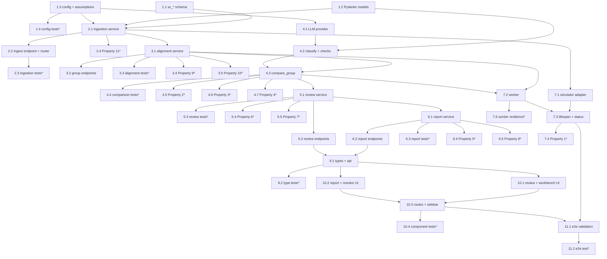

# Implementation Plan — AVIP Source Comparison (LAIR / FAIR / SHQ)

## Overview

This plan implements the production-shaped source-comparison capability as a
native area of the existing **AVIP** portal, following the design document. The
work proceeds **backend-first, then frontend**, in incremental, test-driven
steps so that each layer is built and testable before the layer above it depends
on it.

The pipeline shape is: pluggable **source adapters** (simulator by default) push
records into an **ingestion** endpoint → records are persisted and enqueued on an
in-process `asyncio.Queue` → a **background worker** drains the queue and
**aligns** records by common key (`part_number` + `lot_number`) as they stream in
→ a **comparison** service dispatches each in-scope field to the right check
(exact-match / numeric-threshold vs SHQ reference / LLM-assisted free-text) →
every flag enters a mandatory **review gate** as pending → confirmed
discrepancies flow to a filterable, exportable **report** screen.

The build integrates with AVIP's existing stack and conventions with no new
infrastructure: FastAPI routers under `/api/v1` (registered in
`backend/app/main.py`), SQLite via `aiosqlite` with new `sc_*` tables appended to
`SCHEMA_SQL` in `backend/app/db/database.py`, Pydantic domain models, config via
`backend/app/config.py`, background worker + simulator started in the FastAPI
`lifespan`; and on the frontend React 18 + TypeScript (strict) + Tailwind v3 +
React Query v5 + Recharts inside the shared `AppLayout`, using the shared `api`
client and the existing review-workbench and dashboard UX.

Two previously-open items are resolved **by explicit assumption**, never silently
defaulted, and are labeled **"assumed — pending client confirmation"**: (a) SHQ
is the numeric reference/source-of-truth for numeric-threshold checks; (b) the
near-real-time target is ~5s per record under a simulated feed of a few
records/second. Both are surfaced in the report header banner and structured
logs.

Property-based tests (Hypothesis, minimum 100 iterations each, LLM provider
mocked) validate the 11 Correctness Properties from the design; unit and
integration tests (FastAPI `TestClient`) cover specific examples and edge cases;
frontend component tests use Vitest + React Testing Library. Test sub-tasks are
optional (`*`); core implementation sub-tasks are not.

## Tasks

- [x] 1. Data model, schema, and configuration foundation
  - [x] 1.1 Append the `sc_*` tables to the AVIP schema
    - In `backend/app/db/database.py`, append `sc_source_records`,
      `sc_aligned_groups`, `sc_discrepancies`, `sc_review_decisions`,
      `sc_review_audit`, `sc_rejected_records`, and `sc_comparison_config` to
      `SCHEMA_SQL`, plus the associated indexes, following existing conventions
      (TEXT uuid primary keys, ISO TEXT timestamps, JSON-in-TEXT columns,
      `foreign_keys=ON`) so `init_db()` creates them
    - _Requirements: 1.4, 9.2, 9.6_

  - [x] 1.2 Define Pydantic domain and request/response models
    - Create `backend/app/models/source_comparison.py` mirroring
      `models/inspection.py` style: `SourceType`, `FieldType`, `Provenance`,
      `ReviewState` enums and `IngestRecord`, `SourceRecord`, `AlignedGroup`,
      `Discrepancy`, `DecideRequest` models
    - _Requirements: 3.1, 4.4_

  - [x] 1.3 Implement comparison configuration + assumptions registry
    - Create `backend/app/services/sc_config.py` extending `config.py` Settings:
      `ComparisonConfig` (common_key, in-scope `fields` with types, per-field
      `numeric_thresholds`, `llm_provider`, `assumptions`), `FieldConfig`, and
      `AssumptionItem`
    - Seed the two resolved-by-assumption items with status `"assumed"` and
      label "assumed — pending client confirmation": SHQ numeric benchmark and
      the latency/load target; on startup emit a logged warning for any item
      still `"unresolved"` at a placeholder value rather than substituting a
      default silently
    - _Requirements: 3.6, 3.7, 8.1, 8.2, 8.3, 8.4, 8.5_

  - [ ]* 1.4 Write unit tests for config + assumptions registry
    - Assert in-scope fields, per-field thresholds, common key, and provider are
      read from config; assert an unresolved placeholder emits a logged warning
      and is surfaced; assert seeded assumption items carry the correct label
    - _Requirements: 8.1, 8.2, 8.3, 8.4, 8.5_

- [x] 2. Ingestion service and endpoint
  - [x] 2.1 Implement the ingestion service
    - Create `backend/app/services/ingestion.py`: validate `IngestRecord`
      against the ingestion schema; on success persist to `sc_source_records`
      and enqueue on the in-process `asyncio.Queue`; on failure persist to
      `sc_rejected_records` with source + external record id + raw payload +
      reason and raise a 422 naming source + record id; never discard a record
    - _Requirements: 1.3, 1.4, 1.6, 1.7, 9.2_

  - [x] 2.2 Implement the source-comparison router and ingest endpoint
    - Create `backend/app/routers/source_comparison.py` with
      `POST /source-comparison/ingest` (202 on accept; 422 naming source +
      record id on invalid), and register the router in `backend/app/main.py`
      under `/api/v1`
    - Add `GET /source-comparison/rejected` returning the rejected-records list
    - _Requirements: 1.3, 1.6, 1.7_

  - [ ]* 2.3 Write unit/integration tests for ingestion
    - Via FastAPI `TestClient`: valid record → 202 + persisted + enqueued;
      malformed record → 422 naming source + record id + a `sc_rejected_records`
      row
    - _Requirements: 1.3, 1.4, 1.6, 1.7_

  - [ ]* 2.4 Write property test: invalid records rejected with detail, never dropped
    - **Property 11: Invalid records are rejected with identifying detail, never dropped**
    - Tag: `Feature: avip-source-comparison, Property 11`; Hypothesis min 100 iterations
    - Generate malformed records; assert each is stored in rejected-records with
      a reason naming source + record id and is NOT enqueued
    - _Requirements: 1.6, 1.7_
    - _Properties: 11_

- [x] 3. Streaming alignment service
  - [x] 3.1 Implement common-key alignment
    - Create `backend/app/services/alignment.py`: find-or-create the
      `sc_aligned_groups` row for a record's common key (read from config),
      attach the record, update present/absent source flags, recompute
      `alignment_state` (partial | complete); late arrivals re-evaluate an
      existing partial group; attaching the same record id twice is idempotent;
      records with no derivable common key are marked `unmatched` and retained
    - _Requirements: 2.1, 2.2, 2.3, 2.4, 2.5, 8.3_

  - [x] 3.2 Add aligned-group read endpoints
    - Add `GET /source-comparison/groups` (filter part, lot, state) and
      `GET /source-comparison/groups/{id}` (group + its records) to the router
    - _Requirements: 2.2, 2.4_

  - [ ]* 3.3 Write unit tests for alignment edge cases
    - Single-source, two-source partial, full three-source, and unmatched-key
      cases
    - _Requirements: 2.1, 2.2, 2.4, 2.5_

  - [ ]* 3.4 Write property test: alignment idempotent and order-independent
    - **Property 9: Alignment is idempotent and order-independent (streaming)**
    - Tag: `Feature: avip-source-comparison, Property 9`; Hypothesis min 100 iterations
    - Deliver records for a common key in shuffled order with duplicate
      re-delivery; assert each distinct record appears once and present-sources /
      state are order-independent
    - _Requirements: 2.1, 2.2, 2.3, 2.4_
    - _Properties: 9_

  - [ ]* 3.5 Write property test: late arrival completes without loss
    - **Property 10: Late arrival completes without loss**
    - Tag: `Feature: avip-source-comparison, Property 10`; Hypothesis min 100 iterations
    - Attach a later-arriving record to a partial group; assert earlier records
      are retained, the new record included, and state re-evaluated correctly
    - _Requirements: 2.2, 2.3, 9.2_
    - _Properties: 10_

- [x] 4. Comparison service, checks, and pluggable LLM provider
  - [x] 4.1 Implement the pluggable LLM provider interface
    - Create `backend/app/services/llm_provider.py`: `LLMProvider` protocol,
      `MockLLMProvider` default (no external dependency), `OpenAILLMProvider`
      mirroring the existing `OPENAI_API_KEY` / `OPENAI_MODEL` / `AVIP_VISION_LLM`
      config pattern, and `get_llm_provider(config)` selecting provider from
      config without code changes
    - _Requirements: 5.1, 5.2, 5.3, 8.4_

  - [x] 4.2 Implement field classification and the three checks
    - Create `backend/app/services/comparison.py`: `classify_field` (NUMERIC /
      CATEGORICAL / IDENTIFIER / FREE_TEXT from configured type, not a hardcoded
      list; skip out-of-scope fields); `check_exact` (categorical/identifier,
      flag iff values differ, provenance `exact-match`); `check_numeric` (flag
      iff deviation from the SHQ reference [assumed] exceeds the per-field
      threshold, provenance `numeric-threshold`); `check_free_text` (LLM-assisted,
      free-text only, provenance `llm`; provider error → provenance
      `llm-unavailable`, routed to manual review, never treated as agreeing)
    - _Requirements: 3.3, 3.6, 3.7, 4.1, 4.2, 4.3, 4.5, 5.5, 8.2_

  - [x] 4.3 Implement group comparison dispatch and persistence
    - In `comparison.py`, `compare_group` dispatches each in-scope field via
      `classify_field`, collects discrepancies each carrying non-empty
      provenance, and persists them to `sc_discrepancies` as `pending` (unique
      per `(group_id, field_name)` for idempotent recompare); alignment
      completing/re-completing a group triggers comparison
    - _Requirements: 4.1, 4.2, 4.3, 4.4, 4.5, 5.4_

  - [ ]* 4.4 Write unit tests for the comparison checks
    - Identical vs differing categorical; numeric within vs just outside
      threshold (vs SHQ reference); a free-text pair routed to the mock LLM;
      simulated provider failure yields `llm-unavailable` pending
    - _Requirements: 4.1, 4.2, 4.3, 4.5, 5.5_

  - [ ]* 4.5 Write property test: discrepancy detection correct at boundary
    - **Property 2: Discrepancy detection is correct at the threshold boundary**
    - Tag: `Feature: avip-source-comparison, Property 2`; Hypothesis min 100 iterations
    - Categorical equal/unequal pairs and numeric triples around a parameterized
      threshold vs SHQ reference; assert flag iff discrepant
    - _Requirements: 4.1, 4.2, 4.5_
    - _Properties: 2_

  - [ ]* 4.6 Write property test: every flag carries provenance
    - **Property 3: Every flag carries its provenance**
    - Tag: `Feature: avip-source-comparison, Property 3`; Hypothesis min 100 iterations
    - Arbitrary groups; assert every produced discrepancy has non-empty provenance
    - _Requirements: 4.4_
    - _Properties: 3_

  - [ ]* 4.7 Write property test: LLM used for free-text only
    - **Property 4: Comparison dispatch uses the LLM for free-text only**
    - Tag: `Feature: avip-source-comparison, Property 4`; Hypothesis min 100 iterations
    - Mixed field types; assert the LLM check is invoked iff free-text and never
      for numeric/categorical/identifier fields
    - _Requirements: 3.3, 4.3_
    - _Properties: 4_

- [x] 5. Review gate and audit
  - [x] 5.1 Implement the review service + gate
    - Create `backend/app/services/review.py`: on `decide`, record decision +
      reviewer identity + optional note + timestamp against the discrepancy AND
      write an immutable `sc_review_audit` row; `pending`/`dismissed`
      discrepancies are excluded from the report, `dismissed` permanently
    - _Requirements: 6.1, 6.3, 6.4, 6.5, 9.3_

  - [x] 5.2 Add review endpoints
    - Add `GET /source-comparison/review/queue` (pending discrepancies),
      `GET /source-comparison/review/{id}` (detail), and
      `POST /source-comparison/review/{id}/decide` (body: decision, reviewer,
      optional note) to the router, reusing the existing review-queue shape
    - _Requirements: 6.1, 6.2, 6.3_

  - [ ]* 5.3 Write unit tests for the review gate
    - Confirm/dismiss updates state and writes decision + audit; report excludes
      pending/dismissed
    - _Requirements: 6.3, 6.4, 6.5, 9.3_

  - [ ]* 5.4 Write property test: review decisions round-trip with audit
    - **Property 6: Review decisions round-trip with audit**
    - Tag: `Feature: avip-source-comparison, Property 6`; Hypothesis min 100 iterations
    - Random confirm/dismiss decisions with reviewer + note; assert read-back
      equality and existence of a timestamped audit row
    - _Requirements: 6.3, 9.3_
    - _Properties: 6_

  - [ ]* 5.5 Write property test: LLM free-text output always routes through review
    - **Property 7: LLM free-text output always routes through review**
    - Tag: `Feature: avip-source-comparison, Property 7`; Hypothesis min 100 iterations
    - LLM discrepancies including simulated provider failure; assert each enters
      as pending, is never auto-confirmed or treated as agreeing, and becomes
      final only via recorded confirmation
    - _Requirements: 5.4, 5.5_
    - _Properties: 7_

- [ ] 6. Discrepancy report and export
  - [x] 6.1 Implement the report service
    - Create `backend/app/services/report.py`: assemble confirmed-only
      discrepancies filterable by part, lot, source, field, and provenance; each
      row includes part+lot, field name, the value from each present source, and
      provenance
    - _Requirements: 7.1, 7.2, 7.3, 7.5_

  - [-] 6.2 Add report + export + header endpoints
    - Add `GET /source-comparison/report` (filters, confirmed only),
      `GET /source-comparison/report/export?format=csv` (downloadable, confirmed
      only), and `GET /source-comparison/report/header` (assumptions/open-items
      banner data) to the router
    - _Requirements: 7.1, 7.2, 7.3, 7.4, 8.5_

  - [ ]* 6.3 Write unit/integration tests for report + export
    - Filters by part/lot/source/field/provenance; CSV export contains only
      confirmed rows with complete columns; header surfaces assumption items
    - _Requirements: 7.2, 7.3, 7.4, 8.5_

  - [ ]* 6.4 Write property test: unconfirmed discrepancies never reach the report
    - **Property 5: Unconfirmed discrepancies never reach the report**
    - Tag: `Feature: avip-source-comparison, Property 5`; Hypothesis min 100 iterations
    - Discrepancies with random review states; assert the report equals exactly
      the confirmed subset (no pending/dismissed)
    - _Requirements: 6.1, 6.4, 6.5, 7.2_
    - _Properties: 5_

  - [ ]* 6.5 Write property test: report rows are complete
    - **Property 8: Report rows are complete**
    - Tag: `Feature: avip-source-comparison, Property 8`; Hypothesis min 100 iterations
    - Confirmed discrepancies; assert each rendered row includes part+lot, field
      name, each present source value, and provenance
    - _Requirements: 7.2_
    - _Properties: 8_

- [x] 7. Background worker and simulator adapter
  - [x] 7.1 Implement the source adapter interface and simulator
    - Create `backend/app/services/source_adapters.py`: `SourceAdapter` protocol
      and `SimulatorAdapter` that emits LAIR/FAIR/SHQ records for the REAL seeded
      parts (from `database.py` seeded parts) across the comprehensive field set,
      designating SHQ as the numeric reference (assumed) and injecting a
      controllable discrepancy rate (categorical mismatch, numeric deviation
      beyond threshold, differing free-text notes); configurable records/sec,
      discrepancy_rate, lots/part; pushes each record via the ingestion path
    - _Requirements: 1.1, 1.2, 3.1, 3.2, 3.3, 3.4, 3.5_

  - [x] 7.2 Implement the background worker
    - Create `backend/app/services/worker.py`: drain the ingest queue; per record
      `align_record` → if group state changed, `compare_group`; per-record
      failures caught, logged with structured context, error retained, worker
      keeps running; emit structured logs for ingestion, comparison, and review
      events
    - _Requirements: 1.5, 9.1, 9.4, 9.5_

  - [x] 7.3 Wire worker + simulator into the FastAPI lifespan and add status endpoint
    - Start/stop the worker and simulator `asyncio` tasks in `backend/app/main.py`
      `lifespan` alongside `init_db()`, mirroring existing startup/shutdown; add
      `GET /source-comparison/status` (ingested/rejected counts, partial/complete
      group counts, assumptions snapshot); ensure non-free-text processing
      continues when the LLM provider is unavailable
    - _Requirements: 1.5, 9.1, 9.4, 9.5_

  - [ ]* 7.4 Write property test: every ingested record persisted and classified
    - **Property 1: Every ingested record is persisted and classified**
    - Tag: `Feature: avip-source-comparison, Property 1`; Hypothesis min 100 iterations
    - Mixed valid/invalid record streams; assert every accepted record ends in
      exactly one state (aligned group, unmatched, or rejected) and none is
      absent from all stores
    - _Requirements: 1.4, 1.7, 2.5, 9.2_
    - _Properties: 1_

  - [ ]* 7.5 Write worker-resilience unit test
    - A poisoned record is caught, logged, retained, and the worker keeps
      draining subsequent records
    - _Requirements: 9.5_

- [x] 8. Checkpoint — backend complete
  - Ensure all backend tests pass, ask the user if questions arise.

- [x] 9. Frontend types, API module, and hooks
  - [x] 9.1 Add TypeScript types and the API module
    - Add `SCFieldType`, `SCProvenance`, `SCReviewState`, `SCSourceValue`,
      `SCDiscrepancy`, `SCAssumption`, `SCStatus` to `frontend/src/types/index.ts`
      (strict), and create `frontend/src/api/source-comparison.ts` with typed
      `api.get`/`api.post` wrappers for review queue/detail/decide, report,
      report header, status, and the export URL
    - _Requirements: 6.2, 7.2, 7.4_

  - [ ]* 9.2 Write type-check/unit tests for types + api module
    - Vitest: assert TypeScript `strict` type-checks the new types and api
      wrappers build the expected URLs/params
    - _Requirements: 7.2, 7.4_

- [x] 10. Frontend review, workbench, report, and monitor components
  - [x] 10.1 Implement the review list and workbench
    - Create `frontend/src/components/source-comparison/SourceComparisonReview.tsx`
      (pending list, reuses `ReviewQueue` patterns, `refetchInterval` polling) and
      `SourceComparisonWorkbench.tsx` (single-discrepancy confirm/dismiss + note,
      reuses `ReviewWorkbench` patterns; decide mutation invalidates queries)
    - _Requirements: 6.1, 6.2, 6.3_

  - [x] 10.2 Implement the discrepancy report and ingestion monitor
    - Create `DiscrepancyReport.tsx` (filterable by part/lot/source/field/
      provenance, export link, assumptions banner from `report/header`,
      dashboard/table + Recharts styling, interpretable by a non-technical
      reviewer) and `IngestionMonitor.tsx` (throughput, rejected count,
      assumptions banner) from the status endpoint
    - _Requirements: 7.1, 7.2, 7.3, 7.4, 7.5, 8.5_

  - [x] 10.3 Wire routes and sidebar entry
    - Add the three `/source-comparison/*` routes inside `<AppLayout>` in
      `frontend/src/App.tsx`, and add the sidebar entry to `NAV_GROUPS` plus a
      `getPageTitle` case in `AppLayout.tsx`
    - _Requirements: 6.2, 7.1_

  - [ ]* 10.4 Write frontend component tests
    - Vitest + React Testing Library: review list and workbench render and submit
      decisions (mutation invalidates queries); report renders rows + filters +
      export link and shows the assumptions banner
    - _Requirements: 6.1, 6.3, 7.1, 7.2, 7.3, 7.4, 8.5_

- [ ] 11. End-to-end wiring and validation
  - [-] 11.1 Validate the full stream against the running simulator
    - With the simulator feeding records, confirm ingestion → alignment →
      comparison → review gate → confirmed report works end to end, the
      assumptions banner shows both "assumed — pending client confirmation"
      items, and structured logs are emitted; fix any integration gaps in the
      wiring
    - _Requirements: 1.5, 6.1, 7.1, 8.5, 9.1, 9.4_

  - [ ]* 11.2 Write end-to-end integration test
    - FastAPI `TestClient` (LLM mocked, temporary SQLite): ingest a mixed stream,
      drain the worker, confirm/dismiss discrepancies, and assert the report
      contains only confirmed rows with complete columns
    - _Requirements: 1.4, 2.1, 4.1, 6.1, 7.2_

- [~] 12. Final checkpoint — ensure all tests pass
  - Ensure all tests pass, ask the user if questions arise.

## Notes

- **Backend-before-frontend ordering.** Tasks 1–8 build and test the backend
  (schema, models, config, ingestion, alignment, comparison, review, report,
  worker, simulator) before tasks 9–11 build the frontend that depends on those
  endpoints. Checkpoints (tasks 8, 12) mark validation breaks.
- **Optional-task convention.** Sub-tasks marked with `*` are optional test
  sub-tasks (property tests, unit tests, integration tests, frontend component
  tests) and can be skipped for a faster MVP. Core implementation sub-tasks are
  never marked optional; the model MUST NOT implement `*`-marked sub-tasks and
  MUST implement non-`*` sub-tasks.
- **Hypothesis usage.** Property-based tests use **Hypothesis**, each configured
  to run a **minimum of 100 iterations** with the LLM provider mocked and the DB
  run against a temporary SQLite file. Each is tagged with a comment referencing
  its design property: `Feature: avip-source-comparison, Property N: ...`. The 11
  properties map to test sub-tasks 2.4, 3.4, 3.5, 4.5, 4.6, 4.7, 5.4, 5.5, 6.4,
  6.5, and 7.4.
- **Assumption items (surfaced, never silently defaulted).** Two items are
  resolved **by assumption** and labeled "assumed — pending client confirmation":
  (a) **SHQ numeric benchmark** — SHQ is the reference for numeric-threshold
  checks (deviation measured against SHQ's value); (b) **latency/load target** —
  ~5s per record under a simulated feed of a few records/second (Req 9.1). Both
  are stored in the config `assumptions` registry, emitted in structured logs,
  and shown in the report header banner. Any item that remains genuinely
  `unresolved` at a placeholder value emits a logged warning naming it and is
  surfaced identically (Req 8.5) rather than substituting a default silently.
- **Traceability.** Each task references specific requirements via `_Requirements:_`
  and test tasks additionally reference the design's Correctness Properties via
  `_Properties:_`.

## Task Dependency Graph



```json
{
  "waves": [
    { "id": 0, "tasks": ["1.1", "1.2", "1.3"] },
    { "id": 1, "tasks": ["1.4", "2.1"] },
    { "id": 2, "tasks": ["2.2", "2.4", "3.1", "4.1"] },
    { "id": 3, "tasks": ["2.3", "3.2", "3.3", "3.4", "3.5", "4.2", "7.1"] },
    { "id": 4, "tasks": ["4.3", "7.2"] },
    { "id": 5, "tasks": ["4.4", "4.5", "4.6", "4.7", "5.1", "7.5"] },
    { "id": 6, "tasks": ["5.2", "5.3", "5.4", "5.5", "6.1"] },
    { "id": 7, "tasks": ["6.2", "6.4", "6.5", "7.4"] },
    { "id": 8, "tasks": ["6.3", "7.3"] },
    { "id": 9, "tasks": ["9.1"] },
    { "id": 10, "tasks": ["9.2", "10.1", "10.2"] },
    { "id": 11, "tasks": ["10.3"] },
    { "id": 12, "tasks": ["10.4", "11.1"] },
    { "id": 13, "tasks": ["11.2"] }
  ]
}
```
